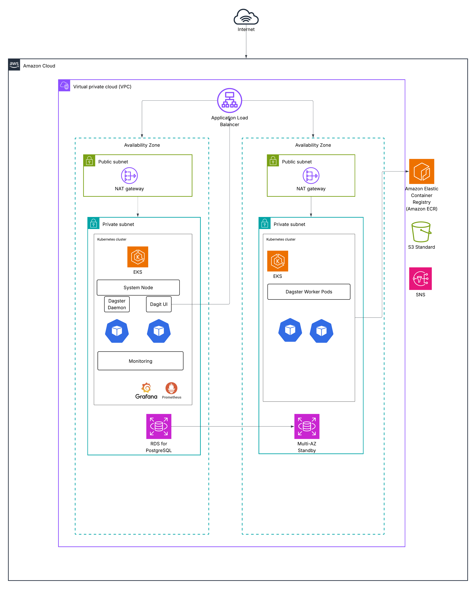
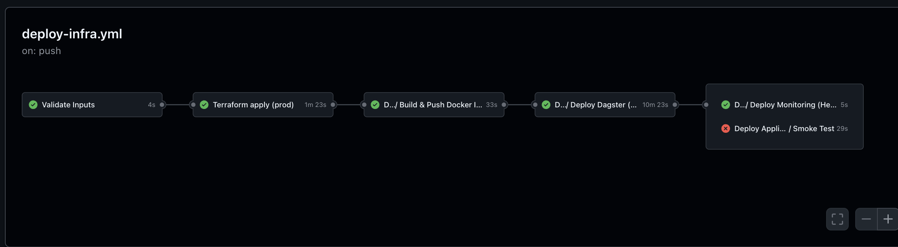
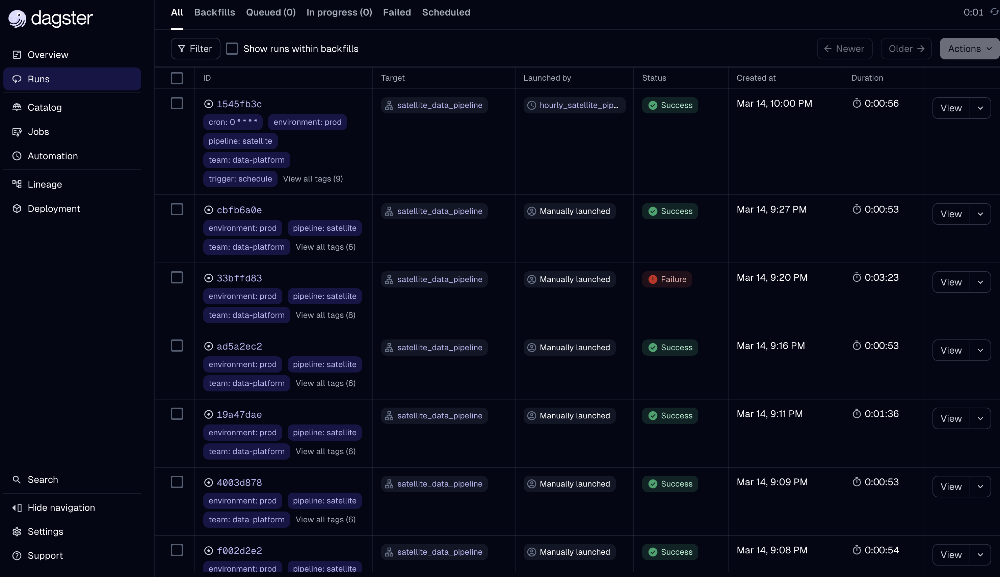
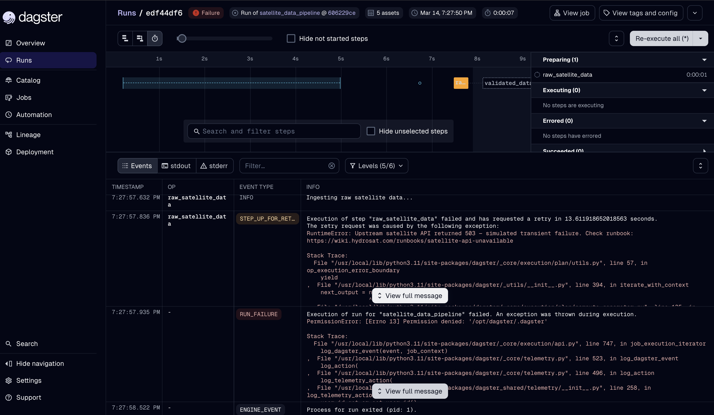
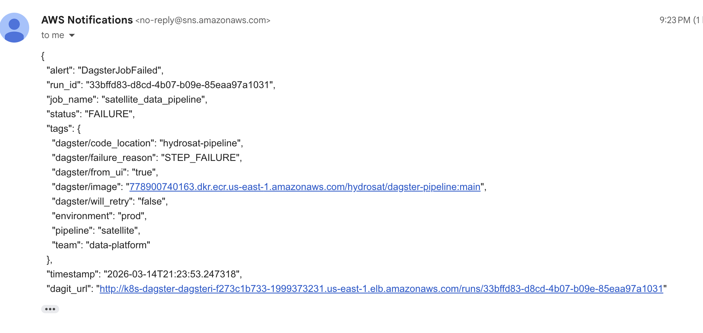
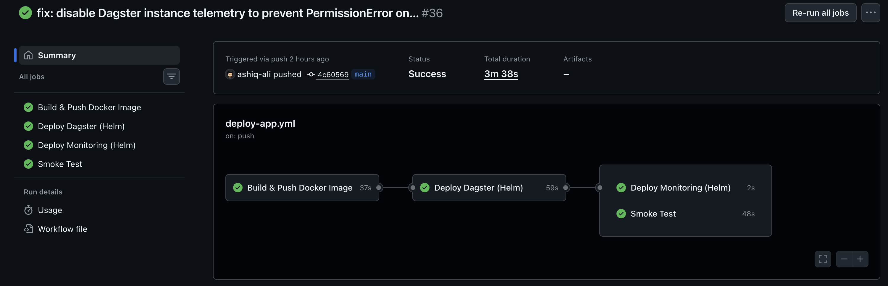

# Dagster Data Platform on Kubernetes 

**Production-ready deployment of [Dagster](https://dagster.io) on Amazon EKS** for geospatial data processing and ML pipelines. This solution implements Infrastructure as Code (Terraform), GitOps CI/CD (GitHub Actions), and automated alerting for data workflows.

**Repository**: https://github.com/ashiq-ali/AWS-DevOps

## Table of Contents

1. [Infrastructure Design](#infrastructure-design) - *Architecture & Technology Choices*
2. [How to Provision](#how-to-provision) - *Step-by-Step Setup Instructions*
3. [How to Use](#how-to-use) - *Trigger Jobs & Access APIs*
4. [How to Test](#how-to-test) - *Testing Methodology & Validation*
5. [Monitoring & Alerting](#monitoring--alerting) - *Observability Implementation*
6. [CI/CD Pipelines](#cicd-pipelines) - *Automation & Release Flow*
7. [Technology Justification](#technology-justification) - *Detailed Decision Rationale*
8. [Repository Structure](#repository-structure) - *Code Organization*

---

## Infrastructure Design


### Architecture Diagram



The diagram above shows the production deployment of DAGSTER on EKS. The main runtime flows are:
- **Traffic**: Internet → ALB in public subnets → Dagster webserver in private EKS subnets
- **Execution**: Dagster daemon launches isolated Kubernetes run pods for pipeline execution
- **Metadata**: Dagster components store run metadata, event logs, and schedule state in RDS PostgreSQL
- **Alerting Path A**: Dagster failure sensor → SNS → email / on-call notification
- **Alerting Path B**: Prometheus rule → Alertmanager → Slack escalation for operator awareness

### Key Architecture Decisions

**1. Amazon EKS Cluster Design:**
- **Two-tier node group strategy**:
  - **System nodes** (`t3.medium`, on-demand): Host the Dagster webserver, daemon, user code deployments, and shared cluster services that must remain continuously available.
  - **Worker nodes** (`t3.medium` / `t3a.medium`, spot instances): Execute Kubernetes job pods for pipeline workloads with scale-to-zero when idle.
- **Justification**: System components need reliability (on-demand), while batch workloads can handle interruptions (spot = 70% cost savings)
- **Operational caveat**: Spot-backed workers are appropriate only for idempotent or retry-safe workloads. Production batch capacity should also use diversified instance pools so the autoscaler has multiple placement options when spot capacity is constrained.

**2. Network Architecture:**
- **VPC**: `10.0.0.0/16` across 2 Availability Zones for high availability
- **Public subnets** (`10.0.1-2.0/24`): ALB endpoints and NAT Gateways
- **Private subnets** (`10.0.10-11.0/24`): EKS nodes and RDS (no direct internet access)
- **NAT Gateways**: One per AZ to prevent cross-AZ traffic costs and eliminate a single egress SPOF

**3. Database Configuration:**
- **RDS PostgreSQL** (`db.t3.medium`, Multi-AZ): External metadata store for Dagster run history, event logs, schedules, and sensors
- **Justification**: Managed PostgreSQL reduces operational overhead while Multi-AZ provides automatic failover for the control plane state

**4. Monitoring Stack Choice:**
- **Prometheus + Grafana + Alertmanager**: CNCF-standard observability stack for cluster and application health
- **Custom Metrics**: Pipeline-specific counters, gauges, and latency histograms exported from Dagster assets
- **Alerting**: Prometheus-based alerting is supplemented by a Dagster-native SNS failure sensor to avoid a single alerting dependency

**5. Security Implementation:**
- **IRSA** (IAM Roles for Service Accounts): Fine-grained permissions without node-level credentials  
- **Private subnets**: Worker nodes with no direct internet access
- **AWS Secrets Manager**: Database credentials and API keys
- **KMS encryption**: EKS secrets and EBS volumes
- **GitHub OIDC**: CI/CD assumes AWS roles without long-lived credentials


---

### EKS Node Groups — Instance Type & Scaling Rationale

| Node Group | Instance | Capacity | Count | Justification |
|---|---|---|---|---|
| **system** | `t3.medium` (2 vCPU / 4 GiB) | On-Demand | min 2, max 4 | Hosts the Dagster control plane and shared cluster services across both AZs. Two nodes provide AZ redundancy for always-on components such as the daemon, webserver, and monitoring agents. |
| **workers** | `t3.medium` / `t3a.medium` | Spot | min 0, max 10 | Runs Dagster workload pods launched by the Kubernetes run launcher. Spot capacity cuts compute cost substantially, and scale-to-zero keeps batch capacity off when there is no queued work, provided jobs are interruption-tolerant and resource requests are set realistically. |

### Scaling Strategies for High Traffic and Long-running Workflows

The repository already implements the core scaling split for Dagster on EKS:

- **System node group** scales the always-on control plane from `2` to `4` nodes.
- **Worker node group** scales execution capacity from `0` to `10` nodes through a node autoscaler such as EKS Cluster Autoscaler. For this design, a managed node-group autoscaler is a reasonable fit because worker capacity is pre-bounded and operationally simple; Karpenter is also a valid alternative if faster, more flexible auto-provisioning is needed later.
- **Dagster webserver** runs with `2` replicas to absorb concurrent UI and GraphQL traffic.
- **Run pods** are isolated by the `K8sRunLauncher`, so heavy workflows scale as separate Kubernetes jobs instead of overloading the webserver or daemon.
- **Executor behavior still matters**: in Dagster, the run launcher determines where a run executes, while the executor determines how steps execute within that run. `K8sRunLauncher` gives per-run isolation; it does not by itself provide step-per-pod fan-out for a single run.
- **Resource requests are the scaling contract**: Kubernetes node autoscalers react to pending pods and their declared CPU and memory requests, not the pods' actual runtime usage. Accurate requests and limits are therefore required for predictable Dagster job scaling.

| Scenario | Primary bottleneck | Scaling strategy in this repo | Operational response |
|---|---|---|---|
| High Dagit / GraphQL traffic | Webserver pods or system nodes | Keep `dagsterWebserver.replicaCount=2`; system node group can expand from `2` to `4` nodes | If UI latency rises or webserver pods restart, first add system-node headroom, then increase webserver replicas in Helm values if sustained traffic justifies it. If traffic becomes materially bursty, consider HPA as a follow-on optimisation rather than the first lever. |
| Spike in pipeline submissions | Worker node pool | The node autoscaler expands the worker node group from `0` toward `10` nodes as Dagster run pods queue up | Watch pending pods, queue depth, and node capacity; raise `worker_node_max` or move to larger worker instance types if the queue persists. Confirm first that pod requests are realistic, otherwise autoscaling decisions will be misleading. |
| Long-running or memory-heavy workflows | Individual run pods | Each Dagster run executes in its own Kubernetes pod with explicit CPU and memory requests and limits | Increase run-pod resources in `helm/dagster/values.yaml` for CPU-bound or memory-bound jobs before scaling the whole cluster indiscriminately |
| Monitoring / control-plane pressure during incidents | Shared system services | System workloads are pinned to the system node group so monitoring and Dagster control-plane services do not compete with batch jobs | Keep monitoring, daemon, and webserver on system nodes; avoid scheduling workload pods there during peak execution windows |

**Practical scaling guidance:**

1. Scale **workers first** when runs are queued, pods stay `Pending`, or long-running workflows are waiting for compute.
2. Scale **webserver replicas or system nodes** when the bottleneck is operator traffic, GraphQL responsiveness, or control-plane stability.
3. Scale **run-pod resources** when a small number of workflows are slow because they are CPU-bound, memory-bound, or repeatedly OOM-killed.
4. Scale **instance types** rather than only node counts when workload characteristics change materially, such as heavier geospatial transforms or larger ML batches.
5. Switch executor strategy if you need **step-level parallelism inside a single run**. `K8sRunLauncher` improves isolation and run concurrency, but it is not the same thing as executing each step in a separate Kubernetes pod.

### VPC Design

> **Note on subnet count:** We provision **four subnets** (2 public + 2 private, one pair per AZ) rather than two. EKS requires subnets in at least two Availability Zones to place its managed control-plane ENIs — a single-AZ setup will fail at `aws_eks_cluster` creation with `UnsupportedAvailabilityZoneException`. Four subnets is the correct configuration for a production EKS deployment with high availability.

- **2 AZs** (us-east-1a, us-east-1b) — minimum for EKS HA
- **Public subnets**: host NAT Gateways and ALB nodes; tagged for `kubernetes.io/role/elb`
- **Private subnets**: host EKS nodes and RDS; tagged for `kubernetes.io/role/internal-elb`; no direct internet access
- **One NAT Gateway per AZ** — eliminates a single egress failure point and avoids cross-AZ data transfer charges
- **VPC Flow Logs** → CloudWatch for security auditing and network troubleshooting

### RDS PostgreSQL

- **Deployment model**: PostgreSQL is provided by Amazon RDS, not by an in-cluster PostgreSQL StatefulSet on EKS.
- **db.t3.medium** with PostgreSQL 15 — suitable for Dagster metadata workloads and operational queries
- **Multi-AZ enabled** — standby replica supports automatic failover for the control-plane database
- **Storage**: `gp3` with autoscaling enabled to absorb metadata growth without manual intervention
- **Backup retention**: 7 days minimum with automated snapshots and point-in-time recovery
- **Credentials in Secrets Manager** — never stored in env vars or ConfigMaps; fetched during deployment from AWS Secrets Manager and injected into Kubernetes at deploy time.

### Security

- **IRSA (IAM Roles for Service Accounts)** for EBS CSI, AWS LB Controller, Cluster Autoscaler — no node-level IAM over-provisioning
- **KMS encryption** for EKS secrets at rest
- **EKS control plane logs** (API, audit, authenticator) → CloudWatch
- **Security Groups** scoped: RDS only accepts traffic from the EKS cluster SG; no public RDS access
- **GitHub Actions uses OIDC** — no long-lived AWS credentials stored in GitHub Secrets

---

## How to Provision


### Prerequisites

```bash
aws-cli   >= 2.x    # brew install awscli
terraform >= 1.6    # brew install terraform
kubectl             # brew install kubectl
helm      >= 3.x    # brew install helm
docker              # docker.com/get-docker
python3   >= 3.11   # for diagrams
```

### Step 1 — Bootstrap (one-time)

This creates the Terraform S3 state backend, DynamoDB lock table, ECR repository, and GitHub Actions OIDC IAM role:

```bash
export AWS_REGION=us-east-1
export GITHUB_ORG=your-org
export GITHUB_REPO=dagster-platform

./scripts/bootstrap.sh
```

The script outputs the GitHub Secrets you must add to the repository.

It also enables the S3 backend block in `terraform/versions.tf`, so the next `terraform init` uses remote state instead of local state.

### Step 2 — Add GitHub Secrets

In your repository: **Settings → Secrets and variables → Actions → New repository secret**

| Secret | Value | Source |
|---|---|---|
| `AWS_ROLE_ARN` | GitHub Actions OIDC role ARN | bootstrap.sh output |
| `AWS_REGION` | `us-east-1` | bootstrap.sh output |
| `ECR_REGISTRY` | `<account>.dkr.ecr.us-east-1.amazonaws.com` | bootstrap.sh output |
| `ECR_REPOSITORY` | `hydrosat/dagster-pipeline` | bootstrap.sh output |
| `TF_STATE_BUCKET` | `hydrosat-terraform-state-<account>` | bootstrap.sh output |
| `ALERT_EMAIL` | On-call distribution email address | Manual |
| `SLACK_WEBHOOK_URL` | Slack incoming webhook URL | Manual |

### Step 3 — Create GitHub Environment

Create a **`production`** environment in **Settings → Environments → New environment** and add required reviewers to gate terraform apply.

### Step 4 — Deploy via GitHub Actions

Push to `main` or trigger manually:

```bash
git push origin main
# → CI workflows run on PR
# → deploy-infra.yml triggers terraform apply on merge
# → deploy-app.yml builds image, pushes to ECR, helm upgrade, smoke tests
```



*GitHub Actions workflow for provisioning the AWS infrastructure and handing off to the application deployment pipeline.*

## How to Use


### Access Dagit (Dagster UI)

```bash
# Get ALB hostname
kubectl get ingress dagster-dagster-webserver -n dagster

# Or port-forward for local access (no ingress)
kubectl port-forward svc/dagster-dagster-webserver 3000:80 -n dagster
# Open: http://localhost:3000
```

### Trigger the satellite pipeline

**Via Dagit UI:**
1. Open Dagit → **Jobs** → `satellite_data_pipeline`
2. Click **Launch Run** → **Launch**

**Via GraphQL API:**
```bash
DAGIT_URL="http://<alb-hostname>"

curl -X POST "${DAGIT_URL}/graphql" \
  -H "Content-Type: application/json" \
  -d '{
    "query": "mutation LaunchRun($input: LaunchRunInput!) { launchRun(executionParams: $input) { __typename ... on LaunchRunSuccess { run { runId status } } } }",
    "variables": {
      "input": {
        "selector": {
          "repositoryLocationName": "hydrosat-pipeline",
          "repositoryName": "__repository__",
          "jobName": "satellite_data_pipeline"
        },
        "runConfigData": {}
      }
    }
  }'
```

**Via Dagster CLI (inside cluster):**
```bash
kubectl exec -it deployment/dagster-dagster-webserver -n dagster -- \
  dagster job execute -j satellite_data_pipeline -m pipeline
```



*Dagster runs view showing successful scheduled and manually launched executions of the `satellite_data_pipeline` job.*

### Access Grafana

```bash
kubectl get ingress -n monitoring  # Get Grafana ALB hostname

# Or port-forward:
kubectl port-forward svc/kube-prometheus-stack-grafana 3001:80 -n monitoring
# Open: http://localhost:3001  (admin / change-me-in-production)
```

Navigate to **Dashboards → Dagster → Dagster Platform — Hydrosat** for the pre-built pipeline dashboard.

### Access Prometheus

```bash
kubectl port-forward svc/kube-prometheus-stack-prometheus 9090:9090 -n monitoring
# Open: http://localhost:9090

# Useful queries:
# dagster:job_success_rate:1h          — pipeline success rate
# dagster_run_failure_total            — total failures
# hydrosat_asset_processing_duration_seconds_bucket  — processing latency histogram
```

### Available Dagster jobs

| Job | Description | Trigger |
|---|---|---|
| `satellite_data_pipeline` | Full pipeline: ingest → validate → features → ML → report | Hourly schedule + manual |
| `satellite_ingestion_only` | Ingestion step only | Manual |
| `ml_inference_only` | Re-score features (after model update) | Daily schedule + manual |

### Schedules and sensors

| Name | Type | Cadence | Description |
|---|---|---|---|
| `hourly_satellite_pipeline` | Schedule | Every hour at `:00` | Triggers the full `satellite_data_pipeline` job |
| `daily_ml_inference` | Schedule | Daily at `06:00 UTC` | Re-scores existing feature data with the latest model |
| `s3_new_data_sensor` | Sensor | Every 60 seconds | Polls the S3 landing prefix for new `.parquet` files and launches idempotent runs |
| `run_failure_alert_sensor` | Sensor | Every 30 seconds | Publishes a Dagster-native SNS alert for failed runs with a direct Dagit run link |

---

## How to Test

### Unit Tests (pipeline code)

```bash
cd dagster
pip install -e ".[dev]"
pytest tests/ -v --tb=short
```

### Integration Test — pipeline end-to-end

```bash
# Trigger a run and poll until completion
RUN_ID=$(curl -s -X POST "${DAGIT_URL}/graphql" \
  -H "Content-Type: application/json" \
  -d '{"query":"mutation { launchRun(executionParams: { selector: { repositoryLocationName: \"hydrosat-pipeline\", repositoryName: \"__repository__\", jobName: \"satellite_data_pipeline\" }, runConfigData: {} }) { ... on LaunchRunSuccess { run { runId } } } }"}' \
  | python3 -c "import sys,json; print(json.load(sys.stdin)['data']['launchRun']['run']['runId'])")

echo "Run ID: ${RUN_ID}"

# Poll run status
for i in $(seq 1 30); do
  STATUS=$(curl -s -X POST "${DAGIT_URL}/graphql" \
    -H "Content-Type: application/json" \
    -d "{\"query\":\"{ runOrError(runId: \\\"${RUN_ID}\\\") { ... on Run { status } } }\"}" \
    | python3 -c "import sys,json; print(json.load(sys.stdin)['data']['runOrError']['status'])")
  echo "Status: ${STATUS}"
  [[ "${STATUS}" == "SUCCESS" ]] && echo "✅ Run succeeded" && break
  [[ "${STATUS}" == "FAILURE" ]] && echo "❌ Run failed" && exit 1
  sleep 10
done
```

### Test alerting

Trigger a deliberate failure (10 % random failure rate is built into `raw_satellite_data`) or force one:

```bash
# Override the failure probability via env var in the user deployment
kubectl set env deployment/dagster-dagster-user-deployments \
  FORCE_FAILURE=true -n dagster

# Launch a run — it will fail

# Validate Prometheus / Alertmanager path
kubectl port-forward svc/kube-prometheus-stack-alertmanager 9093:9093 -n monitoring
# Open: http://localhost:9093 → Alerts tab

# Validate Dagster-native backup path
# Check Slack for the alert notification
# Check the ALERT_EMAIL inbox for the SNS failure notification with the Dagit run URL

# Reset
kubectl set env deployment/dagster-dagster-user-deployments \
  FORCE_FAILURE- -n dagster
```



*Failed run detail in Dagster showing the run timeline, step events, and failure diagnostics available to the on-call engineer.*



*SNS email notification generated by the Dagster failure sensor, including the failed run ID, job metadata, and a deep-link back to Dagit.*

### Smoke test (GitHub Actions)

The `deploy-app.yml` workflow automatically runs a smoke test after every deployment:
1. Polls for ALB hostname readiness
2. Hits `/server_info` endpoint → expects HTTP 200
3. Calls GraphQL `{ version }` → validates response

### Verify monitoring

```bash
# Check all Prometheus alert rules are loaded
curl -s http://localhost:9090/api/v1/rules | python3 -c "
import sys, json
data = json.load(sys.stdin)
dagster_groups = [g for g in data['data']['groups'] if 'dagster' in g['name'].lower()]
for g in dagster_groups:
    print(f\"{g['name']}: {len(g['rules'])} rules\")
"

# Verify Dagster targets are being scraped
curl -s http://localhost:9090/api/v1/targets | python3 -c "
import sys, json
data = json.load(sys.stdin)
for t in data['data']['activeTargets']:
    if 'dagster' in str(t.get('labels', {})):
        print(t['labels']['job'], '-', t['health'])
"
```

---

## Monitoring & Alerting

### Design Philosophy

The monitoring stack is **layered** — belt-and-suspenders — because a single alerting path creates a SPOF:

```
Layer 1: Prometheus + Alertmanager  (primary, metrics-based)
Layer 2: Dagster run_failure sensor → SNS  (Dagster-native, independent of Prometheus)
Layer 3: RDS Enhanced Monitoring + CloudWatch  (database-layer visibility)
```

### Alert Routing

| Alert | Severity | Receiver | Repeat |
|---|---|---|---|
| `DagsterJobFailed` | critical | Slack; SNS email is sent independently by the Dagster failure sensor | 30 min |
| `DagsterDaemonUnhealthy` | critical | Slack | 15 min |
| `DagsterWebserverDown` | critical | Slack | 30 min |
| `DagsterSLOBreach` (success rate < 95 %) | critical | Slack | 1 h |
| `DagsterHighQueueDepth` | warning | Slack | 2 h |
| `DagsterJobRunningTooLong` | warning | Slack | 2 h |
| `DagsterMetricsEndpointDown` | warning | Slack | 2 h |
| `DagsterWorkerOOMKilled` | warning | Slack | 2 h |
| `DagsterRunPodCrashLooping` | warning | Slack | 2 h |
| `DagsterRunPodPending` | warning | Slack | 2 h |

### Scaling Triggers for Operators

- **Scale worker nodes** when `DagsterRunPodPending`, `DagsterHighQueueDepth`, or long scheduling delays show that execution pods cannot get capacity fast enough.
- **Scale run-pod CPU or memory** when Grafana or Prometheus shows repeated OOM kills, CPU throttling, or a single workflow dominating execution time.
- **Scale system capacity** when Dagit becomes slow, the daemon heartbeat is unstable, or monitoring components compete with the control plane for resources.
- **Escalate instance sizes** when the platform is stable but the workload profile has permanently outgrown `t3.medium` / `t3a.medium` capacity.

### On-call Engineer Scenario

The on-call flow is intentionally redundant so the operator can respond whether the incident starts from a Dagster failure or from the monitoring stack.

**Scenario A — Dagster run failure detected first**

1. A Dagster run enters `FAILURE` state and the `run_failure_alert_sensor` publishes a structured SNS message with the run ID, job name, tags, and a direct Dagit URL.
2. The on-call engineer opens the Dagit run page from the SNS email, confirms the failed step, and checks whether the issue is isolated to the pipeline logic or caused by the platform.
3. If the failure is pipeline-specific, the engineer reviews the step logs, asset events, and retry history in Dagit, fixes the input or code issue, and re-runs the job.
4. If the failure appears environmental, the engineer pivots to Grafana and Prometheus to inspect queue depth, pod restarts, scrape health, node saturation, and recent alert history.

**Scenario B — Prometheus or Alertmanager alert fires first**

1. Prometheus evaluates alert rules such as `DagsterDaemonUnhealthy`, `DagsterWebserverDown`, `DagsterRunPodCrashLooping`, or `DagsterSLOBreach`.
2. Alertmanager groups and routes the active alert to Slack, reducing duplicate notifications and preserving severity-based repeat intervals.
3. The on-call engineer opens Grafana to identify the affected service, namespace, pod, or latency trend, then uses Prometheus to inspect the raw metrics and active alert state.
4. If the metrics indicate a user-workload issue, the engineer correlates the alert with the affected Dagster run in Dagit and decides whether to retry, pause schedules, or investigate a bad deployment.
5. If the metrics indicate platform degradation, the engineer remediates at the infrastructure layer by checking Kubernetes events, restarting unhealthy workloads, or rolling back the latest release.

This split-path design matters operationally: SNS provides a direct Dagster incident trail with a deep link into the failed run, while Prometheus, Grafana, and Alertmanager provide the broader service-health and trend context needed for platform triage.

### Prometheus Metrics (Custom)

The pipeline exports these metrics via `prometheus-client`:

| Metric | Type | Description |
|---|---|---|
| `hydrosat_records_processed_total` | Counter | Records processed per asset, per job, per status |
| `hydrosat_asset_processing_duration_seconds` | Histogram | Asset materialisation latency (p50/p95 in Grafana) |
| `hydrosat_data_quality_score` | Gauge | Data quality ratio (0–1) per asset, per run |
| `hydrosat_pipeline_active_runs` | Gauge | Currently active runs per job |

### Why Prometheus + Grafana + Alertmanager?

- **Prometheus** is the de-facto standard for Kubernetes metrics. The `kube-prometheus-stack` chart bundles kube-state-metrics and node-exporter out of the box — giving full cluster visibility with one `helm install`.
- **Dagster's built-in sensors** are excellent for Dagster-native alerting but don't cover infrastructure health (OOM kills, pod crash loops, node pressure). Prometheus covers both.
- **Alertmanager** provides deduplication, grouping, repeat intervals, and Slack routing so operators receive actionable notifications rather than duplicate noise.
- **Grafana** gives the team a single pane of glass: pipeline throughput, data quality scores, processing latency histograms, and cluster resource utilisation — all in one dashboard.
- The **SNS sensor** (Dagster-native) provides an independent backup alerting path that fires even if the Prometheus/Alertmanager stack is degraded.

---

## CI/CD Pipelines

### Workflow Overview

```
PR opened / updated
  ├── ci-terraform.yml  → fmt check, validate, plan, post to PR as comment
  └── ci-app.yml        → ruff lint, mypy, pytest, docker build, Trivy scan

Merge to main (terraform/ changes)
  └── deploy-infra.yml  → terraform apply (requires production env approval)
                             └── calls deploy-app.yml on success

Merge to main (dagster/ changes)
  └── deploy-app.yml
      ├── build-push        → docker build, Trivy scan, push to ECR
      ├── deploy-dagster    → helm upgrade dagster with rollout verification
      ├── deploy-monitoring → helm upgrade kube-prometheus-stack + apply monitoring manifests
      └── smoke-test        → /server_info health check + GraphQL probe
```



*GitHub Actions application deployment workflow showing the build, Dagster Helm deploy, monitoring deployment, and smoke-test stages completing successfully.*

### Key Design Decisions

**OIDC over long-lived credentials** — GitHub Actions assumes an IAM role via OIDC federation. No AWS keys are stored in GitHub Secrets. The trust policy is scoped to the specific `org/repo` — a compromised fork cannot assume the role.

**Concurrency locks** — `deploy-infra` and `deploy-dagster` use `concurrency` groups with `cancel-in-progress: false`. An in-flight apply is never cancelled mid-run — that would leave infrastructure in a partial state.

**Versioned Helm deployments** — chart versions and values are stored in Git, while deployment commands pin chart versions and perform rollout checks after every release. That gives reproducibility without relying on ad-hoc kubectl changes.

**Plan as PR comment** — the Terraform plan diff is posted directly to the PR so reviewers can see exactly what infrastructure changes a merge will trigger, without needing to check Actions logs.

**Production approval gate** — the `production` GitHub Environment requires human approval before `terraform apply` or `helm upgrade` runs against prod. Staging/dev auto-deploy.

---

## Technology Justification

*Required: Explain your process and why you ended up choosing specific technologies*

### Technology Selection Process

**Decision Framework Used:**
For each choice, I prioritised functionality, operational simplicity, cost efficiency, ecosystem maturity, and fit with a Kubernetes-native data platform.

### Why EKS ?

Dagster's Kubernetes execution model is the cleanest fit for EKS. Each run can execute as an isolated Kubernetes workload with explicit CPU and memory limits, predictable scheduling, and first-class cluster observability. ECS is viable for containers, but it does not match Dagster's Kubernetes-native execution and Helm-based operational model as well. Lambda is a poor fit for long-running or stateful data-processing jobs because of execution limits and packaging constraints.

### Why Terraform ?

Terraform provides clear, reviewable infrastructure plans and a mature AWS provider ecosystem. The modular structure used in this repository separates VPC, EKS, RDS, and identity concerns cleanly, which makes the stack easier to reason about, test, and evolve. The remote backend with locking supports team-safe infrastructure changes.

### Why Helm for Dagster ?

The official Dagster Helm chart packages the webserver, daemon, user code deployments, services, RBAC, and configuration into a single versioned release. That is materially easier to operate than maintaining dozens of raw manifests by hand. Helm also makes CI/CD deployment straightforward because environment-specific values can be injected without mutating checked-in manifests.

### Why RDS PostgreSQL for Metadata Storage instead of PostgresSQL on EKS Cluster

Dagster depends on a durable PostgreSQL-compatible store for run metadata, event logs, schedules, and sensors. RDS PostgreSQL provides managed backups, Multi-AZ failover, monitoring integrations, and storage encryption without requiring the team to operate a database inside the cluster. That is the correct trade-off for control-plane state.

### Why Prometheus, Grafana, and Alertmanager and SNS

Prometheus is the natural choice for Kubernetes and application metrics because it supports service discovery, PromQL alerting, and direct ingestion of custom metrics emitted by the pipeline. Grafana complements that with operator-friendly dashboards for throughput, latency, and data quality. Alertmanager adds routing, deduplication, and repeat control so failures become actionable alerts instead of noisy events.

### Why a Dual Alerting Design

Prometheus-based alerting is strong for infrastructure and service health, but it should not be the only path for pipeline failure notifications. The Dagster `run_failure_alert_sensor` publishes directly to SNS, which means failed job alerts still reach an operator even if the monitoring stack itself is impaired. The two paths cover different failure modes and reduce alerting blind spots.

### Why These Instance Types and Scaling Settings

- **System nodes** use on-demand capacity because the Dagster control plane, ingress path, and monitoring agents must remain available.
- **Worker nodes** use spot capacity because data-processing jobs are interruptible and Dagster can recover safely through retries and resubmission. This assumes jobs are idempotent, tolerate restarts, and can safely resume after EC2 spot interruption or pod eviction.
- **Scale-to-zero workers** minimise cost when no runs are queued, while the autoscaler expands the worker pool only when the run launcher creates demand. This only works well when run pods have realistic CPU and memory requests because node autoscalers provision against requested resources, not observed usage.
- **Medium-sized nodes** strike a practical balance between pod density, memory headroom, and cost for application pods, system DaemonSets, and monitoring components.
- **Cluster Autoscaler is a conservative choice** for this topology because it works well with pre-defined managed node groups. If future workloads need more dynamic instance selection, faster provisioning, or broader spot diversification, Karpenter is the main evolution path rather than a fundamentally different architecture.

### Why AWS Load Balancer Controller and ALB

ALB ingress provides a managed internet-facing entry point for Dagit without maintaining an NGINX ingress fleet. The AWS Load Balancer Controller integrates natively with EKS, supports health checks and TLS termination, and keeps ingress configuration declarative in Kubernetes.

### Why GitHub Actions for CI/CD

GitHub Actions fits this repository well because the source code, infrastructure code, and deployment workflows all live together. OIDC integration with AWS removes the need for long-lived access keys, and workflow stages cleanly separate plan, apply, image build, Helm deployment, and smoke testing.

---

## Repository Structure

```
.
├── .gitignore                     # Ignore rules for Terraform state, Python artifacts, secrets, and local tooling
├── .github/
│   └── workflows/
│       ├── ci-terraform.yml        # PR: terraform fmt/validate/plan → PR comment
│       ├── ci-app.yml              # PR: lint, pytest, docker build, Trivy scan
│       ├── deploy-infra.yml        # main merge: terraform apply (with env approval gate)
│       └── deploy-app.yml          # main merge: docker build → ECR → helm upgrade → smoke test
├── terraform/
│   ├── imports.tf                  # Terraform import helpers for existing resources
│   ├── main.tf                     # Root module — wires VPC, EKS, RDS, ALB controller, autoscaler, support resources
│   ├── outputs.tf                  # Root outputs for cluster, database, and supporting infrastructure
│   ├── variables.tf                # Input variables and production defaults
│   ├── versions.tf                 # Provider pins + S3 backend config
│   └── modules/
│       ├── vpc/                    # VPC, subnets, NAT GWs, route tables, flow logs
│       ├── eks/                    # EKS cluster, node groups, IRSA roles, add-ons, AWS LBC policy file
│       ├── github-oidc/            # GitHub OIDC federation for CI/CD role assumption
│       └── rds/                    # RDS PostgreSQL, parameter group, Secrets Manager
├── helm/
│   ├── dagster/values.yaml         # Dagster chart config (ingress, run launcher, worker scheduling)
│   └── monitoring/values.yaml      # kube-prometheus-stack (Prometheus, Grafana, Alertmanager)
├── dagster/
│   ├── dagster.yaml                # Dagster instance configuration
│   ├── workspace.yaml              # Dagster code location workspace definition
│   ├── pyproject.toml              # Python packaging and development dependencies
│   ├── setup.py                    # Editable install entrypoint for the pipeline package
│   ├── Dockerfile                  # Multi-stage image used by CI/CD and EKS deployments
│   ├── docker-compose.yml          # Local Dagster stack for development
│   ├── prometheus-local.yml        # Local Prometheus scrape config for docker-compose
│   ├── pipeline/
│   │   ├── __init__.py             # Definitions entry point
│   │   ├── assets.py               # Software-defined assets (5-stage pipeline)
│   │   ├── jobs.py                 # Job definitions
│   │   ├── sensors.py              # Schedules, S3 sensor, failure alert sensor
│   │   └── resources.py            # S3, Postgres resources + Prometheus metrics
│   ├── tests/
│   │   ├── __init__.py
│   │   ├── test_assets.py          # Asset-level unit tests
│   │   └── test_jobs.py            # Job-definition tests
├── kubernetes/
│   ├── namespaces.yaml             # Namespace bootstrap manifests
│   ├── network-policies.yaml       # Namespace isolation and traffic controls
│   └── monitoring/
│       ├── grafana-dashboard-configmap.yaml # Preloaded Dagster Grafana dashboard
│       └── prometheus-rules.yaml            # Additional PrometheusRule CRDs
├── diagrams/
│   ├── architecture.png            # Architecture diagram used in the README
│   ├── Dag-run.png                 # Dagster successful runs screenshot
│   ├── dag-failure.png             # Dagster failed run screenshot
│   ├── deploy-app.png              # Successful application deployment workflow screenshot
│   ├── deply-infra.png             # Infrastructure deployment workflow screenshot
│   └── sns.png                     # SNS email alert screenshot
└── scripts/
    └── bootstrap.sh               # One-time setup: S3 backend, ECR, OIDC IAM role
```

---
